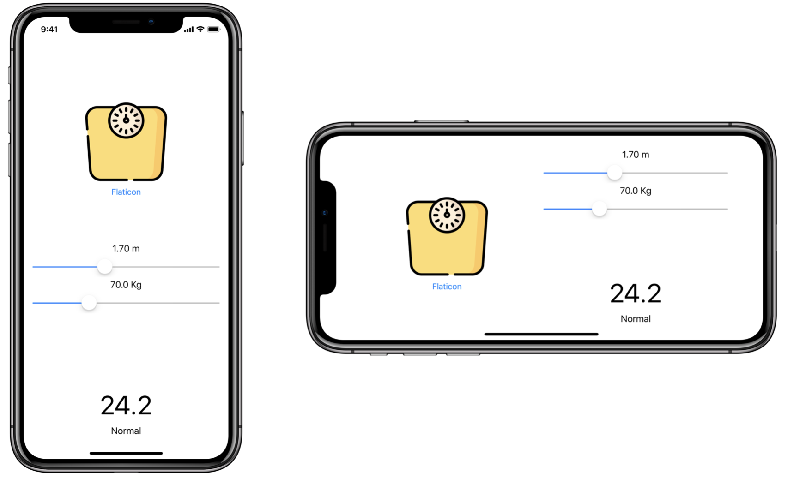

# Calculadora del IMC

Crea Calculadora del índice de masa corporal (IMC) [IMC](Calculadora del índice de masa corporal (IMC)).

## Requisitos

El interfaz de usuario deberá tener este aspecto:

## Restricciones

- Proyecto de tipo iOS App

- Aplicación desarrollada en SwiftUI con estructura MVVM

- Muestra el cálculo al cambiar cualquiera de los valores de los sliders

- Utilizar Stack Views para agrupar los elementos

- Orientación vertical y horizontal

- Iconos: https://www.flaticon.com/
